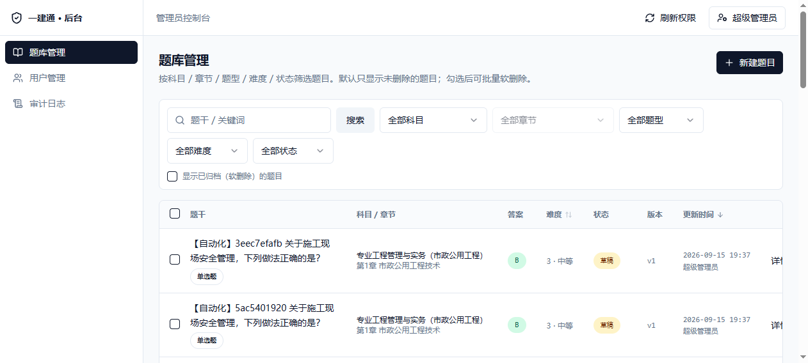
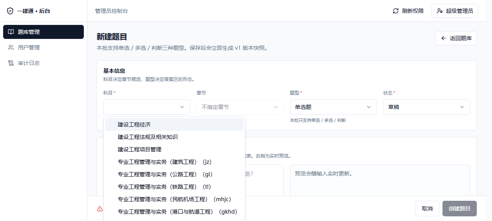
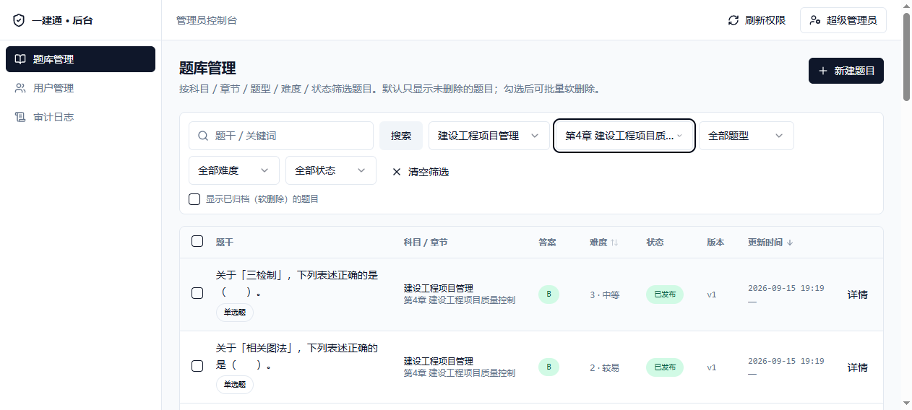
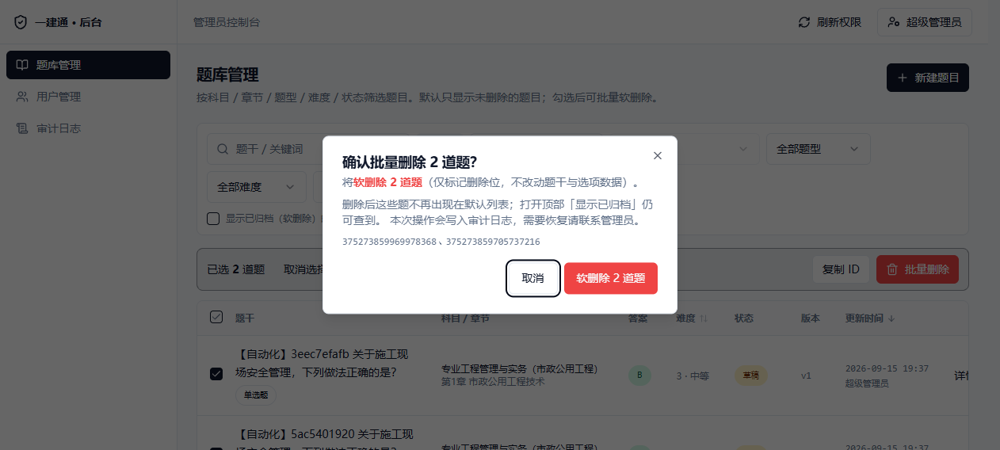
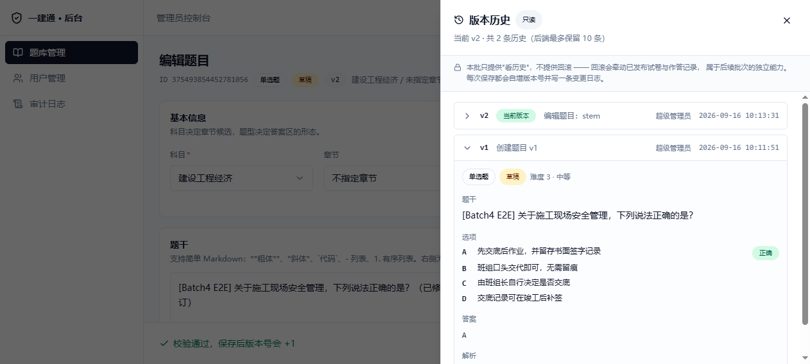
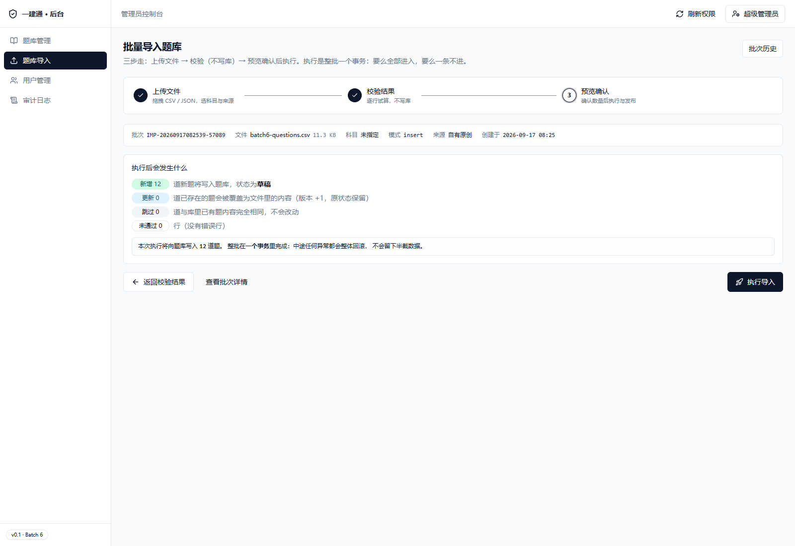
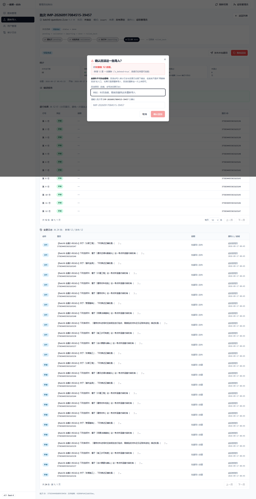

# 一建通 · 一级建造师学习备考平台

> 面向一级建造师考生的 **学习 / 刷题 / 模拟考试 / 进度管理** 一体化平台。
> 移动端优先（H5 + PWA），PC Web 作为管理端与深度阅读端。

---

## 快速开始：5 分钟本地跑起来

> 前置：Docker Desktop（含 Compose v2）+ Node 18+。**无需任何真实密钥** —— 本地直接用模板里的默认值即可跑通。

```bash
# ① 起后端：postgres + redis + api（约 2 分钟）
cd yijian-platform/deploy
cp .env.example .env
docker compose up -d --build
curl http://localhost:8000/api/v1/health          # data.status=ok，postgres/redis 均 up
# Swagger 文档：http://localhost:8000/docs

# ② 起管理后台：Next.js 14（约 2 分钟）
cd ../apps/admin
cp .env.local.example .env.local
npm install
npm run dev                                       # 打开 http://localhost:3000
```

登录用超管账号 **`13800000000` / `Admin@123456`**（api 容器首次启动时自动创建），
登录后默认落在**题库列表**页。更完整的验收路径见下方「三、3 分钟跑通后端」与「四、建库 + 导入种子题库」。

---

## 一、项目当前状态

| 批次 | 内容 | 状态 |
|---|---|---|
| **Batch 1** | 产品方案、信息架构、数据库设计（含可执行 DDL）、API 清单、技术选型、部署方案、题库合规规范 | ✅ 已交付 |
| **Batch 2** | 后端认证 + RBAC + 分层骨架（FastAPI + PostgreSQL + Redis），`docker compose up` 一键起 | ✅ 已交付 |
| **Batch 3** | 管理后台 v0.1：Next.js 14 前端骨架 + 用户管理 / 审计日志（`apps/admin`） | ✅ 已交付 |
| **Batch 4** | **题库 CRUD**：后端 7 个接口 + 前端 3 个页面（列表 / 新建 / 详情编辑）+ 版本历史 | ✅ 已交付 |
| **Batch 5** | **题库批量导入管道**：后端 7 个接口（上传 / 校验 / 执行 / 发布 / 回滚）+ 雪花 ID 精度修复 | ✅ 已交付 |
| **Batch 6** | **导入向导**：前端 4 页（批次列表 / 三步向导 / 批次详情 / 错误报告 CSV）+ 批次变更日志接口 | ✅ 已交付 |
| **Batch 7** | **组卷引擎**：组卷规则 CRUD + 自动组卷 / 卷面校验 / 发布（版本锁定）+ 试卷管理前端 | 🚧 Pass 1（后端）✅ / Pass 2（前端）待做 |

> **交付序号与最初规划不同。** 原「Batch 5」把导入流水线、组卷引擎、记忆曲线、小程序端、
> 支付、数据看板、压测打包在一批里；实际按依赖顺序拆成了
> **Batch 5（导入管道）→ Batch 6（导入向导）→ Batch 7（组卷引擎）**。
> 记忆曲线、小程序端、支付、数据看板仍未启动。
>
> 当前后端共 **46 个接口**，pytest 全量 **92 passed, 1 skipped**。

**每一批都可以独立执行、独立验收。** Batch 2 起，后端本身就是可运行服务：
`cd deploy && cp .env.example .env && docker compose up -d --build` → `http://localhost:8000/docs` 即可点开 Swagger 联调。

- Batch 3 验收：`docs/09-Batch3-管理后台v0.1-方案与骨架.md`
- Batch 4 验收：`docs/10-Batch4-题库CRUD-方案与验收.md`（含 13 张端到端截图与实测缺陷记录）
- Batch 5 验收：`docs/11-Batch5-导入管道-方案与验收.md`
- Batch 6 验收：`docs/12-Batch6-导入向导-方案与验收.md`（含 18 张截图与实测缺陷记录）

### 界面速览（管理后台 · Batch 3 – 6）

| 题库列表（搜索 / 筛选 / 分页） | 新建题目（实时校验，未通过不给提交） |
|:---:|:---:|
|  |  |
| **科目 → 章节联动筛选** | **批量软删除（二次确认）** |
|  |  |
| **题目版本历史（只读快照）** | **导入向导：步骤条 + 具体数字** |
|  |  |
| **回滚二次确认（复述"软删除 N 道" + 手输批次号）** | **更多截图** |
|  | Batch 4 共 13 张 / Batch 6 共 18 张，见 `apps/admin/docs/screenshots/` |

---

## 二、目录结构

```
yijian-platform/
├─ README.md                          # 本文件：总览 + 快速开始
├─ LICENSE                            # MIT 许可
├─ .gitignore
├─ docs/
│   ├─ 01-产品方案.md                  # 定位、角色、功能矩阵、MVP 边界、商业化
│   ├─ 02-信息架构与页面清单.md         # IA 树、页面清单、移动端导航、路由映射
│   ├─ 03-数据库设计.md                # 设计原则、ER 概览、表清单、关键表详解
│   ├─ 04-API接口清单.md               # 统一规范 + 全量 REST 端点
│   ├─ 05-技术选型与系统架构.md         # 技术栈决策表、分层架构、非功能设计
│   ├─ 06-部署运维与安全方案.md         # Docker Compose、Nginx、备份、监控、安全
│   ├─ 07-题库合规与导入规范.md         # 合规来源矩阵、导入/审核/版本/回滚流程
│   ├─ 08-Batch2-验收报告.md           # Batch 2 交付范围、实测结果、验收命令
│   ├─ 09-Batch3-管理后台v0.1-方案与骨架.md
│   ├─ 10-Batch4-题库CRUD-方案与验收.md # Batch 4 方案、6 个 B 端特征、验收证据与实测缺陷
│   ├─ 11-Batch5-导入管道-方案与验收.md # Batch 5 导入管道、data scope、雪花 ID 修复
│   ├─ 12-Batch6-导入向导-方案与验收.md # Batch 6 导入向导、七项交互、18 张截图
│   ├─ 13-Batch7-组卷引擎-方案与验收.md # Batch 7 Pass 1 组卷引擎（接口 / 算法 / 版本锁定 / 实测缺陷）
│   └─ samples/                        # 验收用样例文件（错误报告 / 走查 CSV）
├─ apps/
│   ├─ api/                           # FastAPI 后端（Batch 2 起，逐批扩充）
│   │   ├─ Dockerfile                 # python:3.12-slim，非 root 运行
│   │   ├─ docker-entrypoint.sh       # 等依赖 → 建表 → 建超管 → 启动
│   │   ├─ requirements.txt
│   │   ├─ tests/                     # pytest（92 passed, 1 skipped）：smoke + v3 + v4 + v5 + v7 + idgen
│   │   └─ app/
│   │       ├─ main.py                # 应用入口（中间件 / 异常处理 / 路由挂载）
│   │       ├─ cli.py                 # wait-db / wait-redis / init-db / seed-admin / seed-questions
│   │       ├─ core/                  # 配置、安全、依赖、异常、统一响应、雪花 ID、数据范围
│   │       ├─ db/                    # 引擎与会话、Redis 单例、ORM 模型（仅认证/RBAC/审计 8 表）
│   │       ├─ schemas/               # 入参/出参模型（BigIntStr 统一 ID 序列化）
│   │       ├─ services/              # 业务逻辑（auth / rbac / sms / user / audit / question / import / exam）
│   │       └─ api/v1/                # health / auth / admin_users / admin_rbac / admin_audit
│   │                                 #   / admin_chapters / admin_questions / admin_imports
│   │                                 #   / admin_exams（共 46 个接口）
│   └─ admin/                         # 管理后台（Next.js 14，Batch 3–6）
│       ├─ src/app/(console)/         # questions（列表/new/[id]）/ imports（列表/new/[id]）
│       │                             #   / users / audit-logs
│       ├─ src/components/            # QuestionForm、QuestionVersionDrawer、DataTable、
│       │                             #   StepWizard、ErrorReportTable、RollbackDialog、MarkdownPreview…
│       ├─ src/hooks/                 # useQuestions、useImports、useTableState、useAuth
│       ├─ src/lib/                   # api 客户端、types、permission（MODULE_ENTRIES）、
│       │                             #   question / import 领域逻辑
│       └─ docs/
│           ├─ B端联调坑.md            # 44 条实战坑（现象 → 根因 → 解法 → 落点）
│           ├─ screenshots/batch4/     # Batch 4 端到端截图 13 张
│           ├─ screenshots/batch6/     # Batch 6 端到端截图 18 张
│           └─ screenshots/batch7/     # Batch 7 Pass 2 待产出
├─ tools/local-verify/                # 本地联调脚本：起服务 / 冒烟 / 回归探针 / 导入转换器
├─ db/
│   ├─ schema.sql                     # 可直接执行的 PostgreSQL 建表脚本（64 表 + 3 视图 + 102 索引 + 基础数据）
│   └─ seed/
│       ├─ gen_seed_questions.py      # 原创题库生成器（合规、可复现）
│       └─ validate_seed.py           # 种子题库质检工具
├─ deploy/
│   ├─ docker-compose.yml             # 默认起 postgres + redis + api；meili/minio 走 extras profile
│   └─ .env.example                   # 环境变量模板
└─ data/seed/                         # 生成产物（.gitignore 已忽略）
    ├─ questions.json                 # 6000 题，字段完整
    ├─ questions.sql                  # 26,208 条 INSERT，13.1 MB，幂等
    ├─ questions.csv                  # Excel 友好
    └─ import_manifest.json           # 批次清单（分布 + 校验和）
```

---

## 三、3 分钟跑通后端（Batch 2 主验收路径）

> 前置：本机已装 Docker Desktop / Docker Engine + Compose v2。

```bash
cd yijian-platform/deploy

# 1) 准备环境变量（必须改掉几个 CHANGE_ME 密钥）
cp .env.example .env

# 2) 一键起 postgres + redis + api
docker compose up -d --build

# 3) 看启动日志：应依次出现 等待DB → 等待Redis → 建表 → 超管就绪 → Uvicorn running
docker compose logs -f api

# 4) 健康检查（postgres/redis 都应为 up）
curl http://localhost:8000/api/v1/health
```

打开 **http://localhost:8000/docs** 就是可点的 Swagger。

### 冒烟测试

```bash
cd ../apps/api
pip install -r requirements.txt
ADMIN_INIT_PHONE=13800000000 ADMIN_INIT_PASSWORD=Admin@123456 pytest tests -v
# 全量 92 passed, 1 skipped（1 skipped 是 6000 行导入用例，需环境变量显式开启）
```

`test_smoke.py` 覆盖认证主链路：注册 → `/me` → 密码登录 → 刷新令牌轮换（旧 token 立即失效）→ 登出 →
学员访问管理端 403 → 超管改角色 → **权限缓存立即失效** → 短信限流。
`test_admin_v3/v4/v5.py` + `test_idgen.py` 分别覆盖管理后台、题库 CRUD、导入管道与雪花 ID 精度。

### 手动点两个接口看看

```bash
# 发验证码（SMS_PROVIDER=mock，非生产环境会在响应里回显 dev_code，方便离线联调）
curl -s -X POST http://localhost:8000/api/v1/auth/sms/send \
  -H 'Content-Type: application/json' \
  -d '{"phone":"13800000001","scene":"register"}'

# 用上一步拿到的 dev_code 注册，直接返回令牌对 + 用户信息
curl -s -X POST http://localhost:8000/api/v1/auth/register \
  -H 'Content-Type: application/json' \
  -d '{"phone":"13800000001","code":"<dev_code>","password":"Passw0rd123"}'
```

> 这段演示的是 **Batch 2 当时的 10 个接口**（`/health` + `/auth` 7 个 + `/admin/users` 2 个）——
> 认证与 RBAC 的最小完整闭环，详见 `docs/08-Batch2-验收报告.md`。
> 后续批次在此基础上加了题库 CRUD（Batch 4）、章节树、导入管道（Batch 5）、变更日志（Batch 6）、
> 组卷引擎（Batch 7），**当前共 46 个接口**。

### 手动新建一道题（Batch 4 题库接口）

想快速验证题库链路（或者只是想要一道自己的测试题），按下面这条走一遍即可。
以下用**本地联调端口 8123**；走 `docker compose` 的话换成 `8000`。

```bash
BASE=http://localhost:8123/api/v1

# 1) 拿超管 token（超管由 python -m app.cli seed-admin 创建）
TOKEN=$(curl -s -X POST $BASE/auth/login/password \
  -H 'Content-Type: application/json' \
  -d '{"phone":"13800000000","password":"Admin@123456"}' \
  | python -c 'import sys,json;print(json.load(sys.stdin)["data"]["access_token"])')

# 2) 看一眼科目树，挑一个 subject_id（本地种子数据是 1001 这类小数字）
curl -s "$BASE/admin/chapters/tree" -H "Authorization: Bearer $TOKEN" | head -c 400

# 3) 新建一道单选题
#    ⚠️ 两个容易踩的点：
#      · subject_id 传**字符串**（ID 一律不要 Number()，见坑文档 21）
#      · 答案由 options[].is_correct 推导，不要另外传 answer 字段
curl -s -X POST $BASE/admin/questions \
  -H "Authorization: Bearer $TOKEN" -H 'Content-Type: application/json' \
  -d '{
    "subject_id": "1001",
    "type": "single",
    "stem": "【手测】关于施工现场安全管理，下列说法正确的是？",
    "difficulty": 3,
    "status": "draft",
    "source_type": "self",
    "options": [
      {"label": "A", "content": "先交底后作业，并留存书面签字记录", "is_correct": true},
      {"label": "B", "content": "班组口头交代即可，无需留痕",       "is_correct": false},
      {"label": "C", "content": "由班组长自行决定是否交底",         "is_correct": false},
      {"label": "D", "content": "交底记录可在竣工后补签",           "is_correct": false}
    ],
    "analysis": "安全技术交底必须书面留痕并经双方签字。"
  }'
```

返回的 `data.id` 就是新题 ID，回读详情：

```bash
curl -s "$BASE/admin/questions/<新题ID>" -H "Authorization: Bearer $TOKEN"
```

**更省事的办法**：直接开后台点出来 —— `http://localhost:3000/questions/new`
（登录 `13800000000 / Admin@123456`）。表单会实时告诉你还差什么：
底部提示"✓ 校验通过，可以保存"才能提交；填不完整会明确写出是哪一项不合格。

> **想验证批量删除？** 在本页搜索框输入关键词定位到自己造的题 → 勾选 → 顶部出现
> 「批量删除」→ 二次确认。删除是**软删除**，勾上「显示已归档」还能查到。
> e2e 跑完想恢复数据集：`python tools/local-verify/restore-e2e-softdeleted.py --restore`。

---

## 四、建库 + 导入种子题库（Batch 1 产物）

### 1. 生成种子题库（无需任何依赖，纯标准库）

```bash
cd yijian-platform

# 默认生成 6000 道原创题（3 门公共课 + 建筑/市政/机电 3 个专业）
python db/seed/gen_seed_questions.py --count 6000 --out data/seed

# 只生成经济与法规
python db/seed/gen_seed_questions.py --count 2000 --subjects JGJJ,FAGUI

# 质量检查（校验答案一致性、去重有效性、合规字段）
python db/seed/validate_seed.py data/seed/questions.json
```

### 2. 导数据

```bash
cd deploy

# 建表：postgres 数据卷为空时会自动执行 schema.sql；
#        卷已存在则手动执行下面这条（幂等）
docker compose exec -T postgres psql -U yijian -d yijian < ../db/schema.sql

# 导入题库（也可以用 API 容器的 CLI：docker compose exec api python -m app.cli seed-questions）
docker compose exec -T postgres psql -U yijian -d yijian < ../data/seed/questions.sql
```

### 3. 验证

```bash
docker compose exec -T postgres psql -U yijian -d yijian -c "
  SELECT s.short_name, q.type, count(*)
  FROM questions q JOIN subjects s ON s.id = q.subject_id
  WHERE q.source_type = 'self'
  GROUP BY 1, 2 ORDER BY 1, 2;"
```

### 4. 已实测的产物指标

| 指标 | 实测值 |
|---|---|
| 题目总数 | **6000** |
| 选项总数 | 20,156 |
| 知识点数 | 52 |
| 生成耗时 | 约 0.3 秒 |
| 题型分布 | 单选 3049 / 多选 1501 / 判断 978 / 案例 120 / 案例小题 352 |
| 难度分布 | 1⭐ 480 / 2⭐ 2058 / 3⭐ 2231 / 4⭐ 1067 / 5⭐ 164 |
| 质检结果 | 全部 11 项检查通过，0 错误 0 警告 |
| schema.sql | 64 表 + 3 视图 + 102 索引，1508 行 |

---

## 五、核心设计决策（一句话版）

| 决策点 | 结论 | 理由 |
|---|---|---|
| 前后端分离 | Next.js + FastAPI | 前端做 SEO/PWA，后端做重计算与题库管道 |
| 移动端 | Next.js 响应式 + PWA，**不做原生 APP（一期）** | 一建考生多为在职工程人，扫码即用转化率远高于装 APP |
| 数据库 | PostgreSQL 单库起步，按 `subject_id` 逻辑分片 | 一建题量 1~10 万级，PG 完全够用，避免过早引入分库 |
| 题库检索 | Meilisearch（一期）→ Elasticsearch（可选） | 中文分词开箱即用，资源占用低，单机 200MB 起步 |
| 缓存 | Redis（Session / 限流 / 排行榜 / 热点题目 / 短信验证码） | 一栈多用 |
| 主键 | 雪花 ID（BIGINT）而非自增 | 便于将来分库与数据迁移 |
| 软删除 | `is_deleted` 标记 + 归档任务 | 题库是资产，误删不可接受 |
| 题目版本 | 一题多版本快照 + 变更日志 | 已考过的卷不能因为改题而失真 |

---

## 六、合规声明

本项目**不内置任何受版权保护的真题原文**。

- `db/seed/gen_seed_questions.py` 产出的是**基于考纲知识点的原创仿真题**，用于技术验证与冷启动兜底。
- 生产题库必须通过 `docs/07-题库合规与导入规范.md` 定义的合规通道进入：
  **自有教研产出 / 已授权采购 / 公开可用内容 / 用户合法导入**。
- 任何网络采集行为必须遵守 `robots.txt`、目标站点服务条款与《著作权法》，禁止抓取受版权保护内容。

---

## 七、下一步

**Batch 1 ~ 7 Pass 1 + 前置修正已完成**（认证/RBAC → 管理后台 → 题库 CRUD → 导入管道
→ 导入向导 → 组卷引擎后端 + locked_version 列 / viewer 只读 / 试卷归档）。
往下可以接着推：

- **Batch 7 Pass 2（下一步）** → 试卷管理前端：`/exams` 列表（含"显示已归档"开关）、
  `/exams/new`（手动选题 / 规则自动组卷）、`/exams/[id]`（卷面结构预览 + 加题/移题 +
  发布 + 归档）、`/paper-rules` 规则管理。
  后端 **17 个接口**与 `shortfalls` / 版本锁定 / 加题移题 / 归档恢复 / viewer 只读能力已就绪（见 `docs/13` §9）
- **记忆曲线** → 学员练习调度算法（依赖答题记录，需 C 端先落地）
- **移动端骨架** → 学员侧页面：首页倒计时、章节练习、答题卡、错题本、模拟考试、成绩报告
- **「调整方案」** → 告诉我哪里要改（比如要换 Spring Boot / 要加直播 / 要做多租户加盟商）

> ⚠️ **批量导入落地前必读**：导入会在同一毫秒连出多个雪花 ID，
> 正是坑文档第 21 条那颗雷的触发条件。**Batch 5 Pass 0 已修复**（生成端唯一 + 传输端全程字符串），
> 回归手段见 `tools/local-verify/probe-snowflake-batch.py` 与 `apps/api/tests/test_idgen.py`（15 条）。
> 后续任何"批量生成 ID"或"把 ID 拼进请求体"的新代码，都要再跑一次这两道防线。
>
> ⚠️ **组卷前必读**：版本锁定用**独立列** `exam_questions.locked_version`
> （`db/migrations/20260917-01-*.sql` 加的，含从旧 JSONB 的回填）。
> `rule_config.question_locks` 已 **deprecated**（仍双写 + 读时回退，下一批清理）。
> 另注意 `subjects` / `paper_rules` 等表**没有 `is_deleted`**，写校验前先看 `db/schema.sql`。
>
> ⚠️ **改了 `db/schema.sql` 别忘了写迁移**：`run-smoke.ps1` 只在**首次建库**时载入
> schema.sql，库已存在就整段跳过 —— 新结构只在新库存在（`B端联调坑.md` 坑 39）。
> 迁移放 `db/migrations/`，脚本自身必须幂等。
>
> 其余已知遗留项见 `docs/10-Batch4-题库CRUD-方案与验收.md` §7、
> `docs/12-Batch6-导入向导-方案与验收.md` §8、`docs/13-Batch7-组卷引擎-方案与验收.md` §7。
