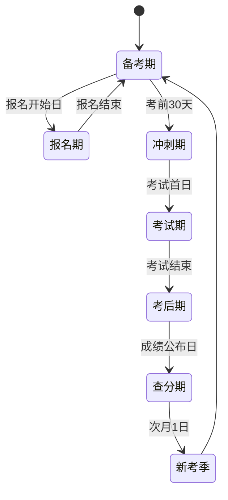

# 02 · 信息架构与页面清单

## 1. 信息架构（IA）

```
一建通
│
├─ 【学员端 · 移动优先】
│   ├─ 首页
│   │   ├─ 考试倒计时（报名/缴费/准考证/考试/查分 多节点）
│   │   ├─ 今日任务（计划驱动：N 题 + M 分钟课）
│   │   ├─ 继续学习（断点续播）
│   │   ├─ 快捷入口：章节练习 / 每日一练 / 模考 / 错题本
│   │   ├─ 我的掌握度环（4 科正确率）
│   │   └─ 公告条
│   │
│   ├─ 学习
│   │   ├─ 科目列表（公共课 3 + 专业课 N）
│   │   ├─ 科目详情 → 章节树 → 知识点
│   │   ├─ 课程详情 → 课时列表 → 播放页
│   │   ├─ 讲义（图文 / PDF）
│   │   ├─ 考点卡片
│   │   └─ 学习计划（周视图 / 日清单）
│   │
│   ├─ 题库（Tab 中心）
│   │   ├─ 练习入口
│   │   │   ├─ 章节练习
│   │   │   ├─ 每日一练
│   │   │   ├─ 随机练习
│   │   │   ├─ 历年真题
│   │   │   ├─ 案例专项
│   │   │   └─ 自组卷
│   │   ├─ 答题页（题干 / 选项 / 答题卡 / 解析 / 笔记 / 收藏 / 报错）
│   │   ├─ 练习结果页
│   │   ├─ 题库浏览（筛选：科目/章节/题型/难度/年份/来源/状态）
│   │   └─ 搜索
│   │
│   ├─ 考试
│   │   ├─ 模考列表（全真模考 / 历年真题卷 / 专项卷）
│   │   ├─ 考前须知
│   │   ├─ 考试中（计时 / 答题卡 / 标记 / 交卷确认）
│   │   ├─ 成绩报告（得分 / 知识点雷达 / 用时分布 / 错题清单）
│   │   ├─ 主观题自评 / 批改结果
│   │   └─ 排行榜
│   │
│   ├─ 我的
│   │   ├─ 学习档案（报考科目、专业、省份、年份、目标分）
│   │   ├─ 我的错题本（含记忆曲线待复习）
│   │   ├─ 我的收藏
│   │   ├─ 我的笔记
│   │   ├─ 做题记录
│   │   ├─ 学习报告（周报/月报）
│   │   ├─ 薄弱点分析
│   │   ├─ 会员中心（权益、订单）
│   │   ├─ 消息中心
│   │   ├─ 离线缓存管理
│   │   └─ 设置（账号、通知、缓存、隐私、注销）
│   │
│   └─ 资讯
│       ├─ 公告列表 / 详情
│       ├─ 政策解读
│       └─ 考试日历
│
└─ 【管理端 · PC 优先】
    ├─ 工作台（核心指标看板）
    ├─ 题库管理
    │   ├─ 题目列表（高级筛选）
    │   ├─ 题目编辑（富文本 + 公式 + 图片）
    │   ├─ 批量导入（上传 → 字段映射 → 校验 → 去重 → 预览 → 入库）
    │   ├─ 导入批次（进度 / 错误报告 / 回滚）
    │   ├─ 审核队列
    │   ├─ 版本与变更日志
    │   └─ 章节 / 知识点管理
    ├─ 组卷管理（手动组卷 / 规则组卷 / 试卷库）
    ├─ 课程管理（课程 / 课时 / 媒体 / 讲义）
    ├─ 用户管理（列表 / 详情 / 学习档案 / 封禁 / 标签）
    ├─ 订单与权益（订单 / 退款 / 权益 / 对账）
    ├─ 内容运营（公告 / Banner / 推送 / 优惠券）
    ├─ 数据中心（趋势 / 漏斗 / 题目质量 / 收入）
    ├─ 系统设置（角色权限 / 字典 / 参数 / 集成）
    └─ 审计日志
```

---

## 2. 移动端导航结构

### 2.1 底部 Tab（4 个，单手可达）

| Tab | 图标语义 | 默认落地页 | 说明 |
|---|---|---|---|
| 首页 | 房子 | `/` | 倒计时 + 今日任务 |
| 刷题 | 铅笔 | `/practice` | 练习总入口 |
| 考试 | 计时器 | `/exam` | 模考与报告 |
| 我的 | 人像 | `/me` | 个人中心 |

> 学习内容（课程/讲义）从首页与刷题页进入，避免 5 个 Tab 挤窄。资讯放在首页顶部横滑卡片。

### 2.2 移动端交互规范（触屏优化）

| 项 | 规范 |
|---|---|
| 最小可点区域 | 44×44 px |
| 主按钮高度 | 48 px，底部安全区留白 `env(safe-area-inset-bottom)` |
| 答题切题 | 左右滑动（阈值 60px），或底部上/下题按钮 |
| 选项点击 | 整行可点，非仅文字；选中态高亮 + 触感反馈（`navigator.vibrate`） |
| 答题卡 | 底部抽屉，网格 5 列，颜色区分：未做/已做/标记/当前 |
| 长按 | 长按题干 → 标记/复制/反馈 |
| 字号 | 题干 16px，解析 15px，行高 1.7（工地户外可读性） |
| 深色模式 | 跟随系统，夜间刷题护眼 |
| 横屏 | 仅视频页支持，其他页面锁定竖屏（PWA manifest） |
| 断网提示 | 顶部常驻条「当前离线，已完成 X 题待同步」 |

### 2.3 PWA 配置要点

```json
{
  "name": "一建通 · 一级建造师备考",
  "short_name": "一建通",
  "start_url": "/?source=pwa",
  "display": "standalone",
  "orientation": "portrait",
  "theme_color": "#C8102E",
  "background_color": "#FFFFFF",
  "icons": [
    { "src": "/icons/192.png", "sizes": "192x192", "type": "image/png" },
    { "src": "/icons/512.png", "sizes": "512x512", "type": "image/png", "purpose": "maskable" }
  ]
}
```

Service Worker 策略：

| 资源类型 | 策略 |
|---|---|
| 静态资源（JS/CSS/字体/图标） | Cache First + 版本化 |
| 接口 GET（科目树、题目、解析） | Stale-While-Revalidate |
| 写接口（答题提交、进度上报） | 离线入 IndexedDB 队列，联网后 Background Sync 顺序重放 |
| 视频 | 不做 SW 缓存，走 HLS 分级 + 可选本地下载 |
| 图片 | Cache First + 容量上限 100 张，LRU 淘汰 |

---

## 3. 页面清单（含路由映射）

### 3.1 学员端页面（P0 = MVP）

| # | 页面名 | 路由 | 优先级 | 关键要素 |
|---|---|---|---|---|
| 1 | 首页 | `/` | P0 | 倒计时、今日任务、继续学习、掌握度环、公告 |
| 2 | 登录 | `/login` | P0 | 手机号+验证码 / 密码 双 Tab |
| 3 | 注册 | `/register` | P0 | 手机号+验证码+密码，自动登录 |
| 4 | 找回密码 | `/forgot` | P0 | 手机号 → 验证码 → 新密码 |
| 5 | 初次引导 | `/onboarding` | P0 | 选报考科目、实务专业、考试年份、目标分 |
| 6 | 科目列表 | `/subjects` | P0 | 3 公共课 + 10 专业 |
| 7 | 科目详情 | `/subjects/[code]` | P0 | 章节树、进度条、真题入口 |
| 8 | 知识点详情 | `/subjects/[code]/kp/[kpId]` | P0 | 考点讲解 + 关联题目 |
| 9 | 课程列表 | `/courses` | P0 | 按科目筛选 |
| 10 | 课程详情 | `/courses/[id]` | P0 | 大纲、课时、试看、购买 |
| 11 | 播放页 | `/lesson/[id]` | P0 | 播放器、目录抽屉、笔记、进度上报 |
| 12 | 讲义阅读 | `/lesson/[id]/doc` | P1 | 划线、批注 |
| 13 | 学习计划 | `/plan` | P0 | 周视图 + 日任务清单 |
| 14 | 练习入口 | `/practice` | P0 | 6 种练习模式卡片 |
| 15 | 章节练习配置 | `/practice/chapter` | P0 | 选章节 + 题量 + 题型 |
| 16 | 每日一练 | `/practice/daily` | P0 | 每日 10 题，含分享 |
| 17 | 随机练习 | `/practice/random` | P0 | 按科目/难度/题型 |
| 18 | 真题演练 | `/practice/real` | P0 | 按年份列表 |
| 19 | 案例专项 | `/practice/case` | P0 | 案例题列表 |
| 20 | 自组卷 | `/practice/custom` | P1 | 题型配比 + 题量 + 难度 |
| 21 | **答题页** | `/practice/session/[id]` | P0 | 核心页：题干、选项、答题卡、解析、笔记、收藏、报错 |
| 22 | 练习结果 | `/practice/result/[id]` | P0 | 正确率、用时、错题清单、重做错题 |
| 23 | 题库浏览 | `/bank` | P0 | 多条件筛选列表 |
| 24 | 题目详情 | `/bank/[id]` | P0 | 单题查看 |
| 25 | 搜索 | `/search` | P0 | 题干/知识点/标签 |
| 26 | 模考列表 | `/exam` | P0 | 全真模考 / 真题卷 |
| 27 | 模考须知 | `/exam/[id]/intro` | P0 | 时长、分值、规则 |
| 28 | **考试中** | `/exam/attempt/[attemptId]` | P0 | 计时、答题卡、标记、交卷 |
| 29 | 交卷确认 | `/exam/attempt/[id]/confirm` | P0 | 未答提醒 |
| 30 | 成绩报告 | `/exam/report/[attemptId]` | P0 | 得分、雷达图、用时、错题 |
| 31 | 主观题自评 | `/exam/report/[id]/self-score` | P0 | 逐评分点勾选 |
| 32 | 排行榜 | `/exam/[id]/ranking` | P1 | 本科目榜 |
| 33 | 错题本 | `/me/wrong` | P0 | 待复习 / 全部，含记忆曲线入口 |
| 34 | 错题重练 | `/me/wrong/review` | P0 | 到期复习队列 |
| 35 | 收藏 | `/me/favorites` | P0 | |
| 36 | 笔记 | `/me/notes` | P0 | |
| 37 | 做题记录 | `/me/history` | P0 | 按天分组 |
| 38 | 我的（Tab 主页） | `/me` | P0 | 档案、入口聚合 |
| 39 | 学习档案 | `/me/profile` | P0 | |
| 40 | 学习报告 | `/me/report` | P0 | 周报/月报，可分享图 |
| 41 | 薄弱点分析 | `/me/weak` | P0 | 知识点排行 + 一键练 |
| 42 | 会员中心 | `/me/vip` | P1 | 权益、套餐 |
| 43 | 我的订单 | `/me/orders` | P1 | |
| 44 | 消息中心 | `/me/messages` | P0 | 站内信 |
| 45 | 离线管理 | `/me/offline` | P1 | 缓存占用、清理 |
| 46 | 设置 | `/me/settings` | P0 | 账号、通知、隐私 |
| 47 | 公告列表 | `/news` | P0 | |
| 48 | 公告详情 | `/news/[id]` | P0 | |
| 49 | 考试日历 | `/news/calendar` | P1 | |

### 3.2 管理端页面

| # | 页面名 | 路由 | 优先级 |
|---|---|---|---|
| A1 | 登录 | `/admin/login` | P0 |
| A2 | 工作台 | `/admin` | P0 |
| A3 | 题目列表 | `/admin/questions` | P0 |
| A4 | 题目编辑 | `/admin/questions/new` `/admin/questions/[id]` | P0 |
| A5 | 批量导入 | `/admin/questions/import` | P0 |
| A6 | 导入批次详情 | `/admin/questions/import/[batchId]` | P0 |
| A7 | 审核队列 | `/admin/questions/review` | P0 |
| A8 | 变更日志 | `/admin/questions/logs` | P0 |
| A9 | 章节/知识点管理 | `/admin/subjects` | P0 |
| A10 | 组卷 | `/admin/exams/new` | P0 |
| A11 | 试卷库 | `/admin/exams` | P0 |
| A12 | 课程管理 | `/admin/courses` | P0 |
| A13 | 用户列表 / 详情 | `/admin/users` `/admin/users/[id]` | P0 |
| A14 | 订单管理 | `/admin/orders` | P0 |
| A15 | 权益管理 | `/admin/entitlements` | P1 |
| A16 | 公告管理 | `/admin/announcements` | P0 |
| A17 | 推送管理 | `/admin/notifications` | P1 |
| A18 | 数据中心 | `/admin/analytics` | P0 |
| A19 | 题目质量分析 | `/admin/analytics/questions` | P1 |
| A20 | 角色权限 | `/admin/system/roles` | P0 |
| A21 | 系统参数 | `/admin/system/configs` | P0 |
| A22 | 审计日志 | `/admin/system/audit-logs` | P0 |

---

## 4. 关键页面线框说明（移动端）

### 4.1 首页 `/`

```
┌─────────────────────────────┐
│ 距离 2027 一建考试  ▸ 365 天 │  ← 渐变卡，可切换节点
└─────────────────────────────┘
┌─────────────────────────────┐
│ 今日任务          2/5 完成   │
│ ✓ 建设工程经济 · 第3章 精讲  │
│ ○ 章节练习 20 题   ▶ 去完成  │
│ ○ 每日一练 10 题   ▶ 去完成  │
└─────────────────────────────┘
┌─────────────────────────────┐
│ 继续学习  建设工程法规 12:34 │
│ ▓▓▓▓▓▓░░░░  62%            │
└─────────────────────────────┘
┌──────┬──────┬──────┬──────┐
│章节练│每日一│ 模考 │错题本│
├──────┼──────┼──────┼──────┤
│真题  │案例  │薄弱点│报告  │
└──────┴──────┴──────┴──────┘
┌─────────────────────────────┐
│ 我的掌握度                   │
│  经济 68%  法规 74%          │
│  管理 55%  实务 41%  ⚠️       │
└─────────────────────────────┘
[首页]  [刷题]  [考试]  [我的]
```

### 4.2 答题页 `/practice/session/[id]`

```
┌─────────────────────────────┐
│ ← 3/20        ⏱ 02:15   ⋮  │
├─────────────────────────────┤
│ [单选] [★★★☆☆] 2024·第3章   │
│                             │
│ 关于建设工程经济中现金流量    │
│ 图的绘制规则，下列说法正确    │
│ 的是（  ）                   │
│                             │
├─────────────────────────────┤
│ ○ A. 时间轴上的点表示现金流入 │
│ ● B. 箭线上方表示现金流入     │  ← 选中
│ ○ C. 箭线长短必须按比例绘制   │
│ ○ D. 零线只能位于时间轴下方   │
└─────────────────────────────┘
┌─────────────────────────────┐
│ 解析（提交后展示）           │
│ ✓ 正确答案 B                 │
│ 现金流量图三要素…            │
│ 📌 关联考点：现金流量图绘制   │
└─────────────────────────────┘
[ ☆收藏 ] [ ✎笔记 ] [ ⚑报错 ] [ 答题卡 ]
```

### 4.3 考试中 `/exam/attempt/[id]`

```
┌─────────────────────────────┐
│ 建设工程经济   ⏱ 01:58:22    │
│ 剩余 78 题  已答 42          │
├─────────────────────────────┤
│ （题面区，同答题页）          │
├─────────────────────────────┤
│ [上一题]     [标记]   [答题卡]│
└─────────────────────────────┘

答题卡抽屉（点「答题卡」上滑）：
┌─────────────────────────────┐
│ 答题卡           已答 42/78  │
│ ■已答 □未答 ⚑标记 ●当前     │
│ ①②③④⑤⑥⑦⑧⑨⑩              │
│ ⑪⑫⑬⑭⑮…                    │
│ [ 交卷 ]                     │
└─────────────────────────────┘
```

---

## 5. 首页倒计时状态机（考期驱动）



| 状态 | 首页主视觉 | 主推内容 |
|---|---|---|
| 备考期 | 「距离考试 XXX 天」 | 系统学习计划、章节练习 |
| 报名期 | 「报名进行中，还剩 X 天」 | 报名指导、资料清单 |
| 冲刺期 | 「冲刺 X 天，今日必做」 | 押题卷、考点速记、模考大赛 |
| 考试期 | 「考试进行中，加油！」 | 考前提醒、考场须知 |
| 考后期 | 「考完了？来对答案估分」 | 估分工具、真题解析直播 |
| 查分期 | 「成绩已出，来查分」 | 查分入口、二战/增项转化 |

该状态由 `exam_calendar` 表 + 定时任务计算后写入 Redis 缓存，前端只读一个 `/api/v1/me/countdown` 接口。

---

## 6. 埋点清单（关键转化与体验）

| 事件名 | 触发时机 | 关键属性 |
|---|---|---|
| `app_launch` | 应用启动 | source, is_pwa, network |
| `page_view` | 路由变化 | path, referrer, duration |
| `onboarding_done` | 完成引导 | subjects, professional, exam_year |
| `practice_start` | 开始练习 | mode, subject_id, question_count |
| `question_answer` | 提交单题 | question_id, is_correct, time_ms, is_first |
| `practice_finish` | 结束练习 | accuracy, duration, count |
| `paywall_show` | 付费墙曝光 | trigger_point, plan_id |
| `order_create` | 创建订单 | product_id, amount |
| `pay_success` | 支付成功 | order_id, amount, channel |
| `exam_submit` | 交卷 | exam_id, score, duration |
| `offline_sync` | 离线数据同步 | queued_count, failed_count |
