# 03 · 数据库设计

> 可执行 DDL：`db/schema.sql`（PostgreSQL 14+，可重复执行，含基础数据 UPSERT）
> 本文档解释「为什么这么设计」与「怎么用」。

---

## 1. 设计原则

| 原则 | 落地方式 | 解决什么问题 |
|---|---|---|
| **主键不用自增** | 全部 `BIGINT`，应用层雪花算法生成 | 将来分库/数据迁移不用改主键；批量导入时可预先分配 |
| **软删除优先** | 业务表 `is_deleted`，题库永不物理删除 | 题目是核心资产，误删不可逆；历史卷需要能还原 |
| **枚举用 VARCHAR + CHECK** | 不用 PostgreSQL 原生 ENUM | 加一个枚举值不用 `ALTER TYPE` 锁表 |
| **时间统一 TIMESTAMPTZ** | 全部带时区，默认 `now()` | 跨省考生 + 服务器多地域不出现时区错乱 |
| **高频读做冗余** | `chapters.question_count`、`question_stats`、`user_subject_stats` | 题库列表页不做实时 `count(*)`，改为定时刷新 |
| **大表预留分区** | `practice_items`、`user_question_state`、`audit_logs` | 千万行后不改表结构即可切分区 |
| **内容有版本** | `question_versions` + `content_change_logs` + `bank_versions` | 已考过的卷不能因为改题而失真；支持整库回滚 |
| **去重靠指纹** | `questions.content_hash` 部分唯一索引 | 批量导入天然幂等，重复导入零副作用 |

---

## 2. ER 关系概览

```mermaid
erDiagram
    users ||--o| user_profiles : "学习档案"
    users ||--o{ user_identities : "第三方登录"
    users ||--o{ user_sessions : "登录态"
    users ||--o{ user_roles : "角色"
    roles ||--o{ role_permissions : ""
    permissions ||--o{ role_permissions : ""

    users ||--o{ orders : ""
    products ||--o{ orders : ""
    orders ||--o{ payments : ""
    users ||--o{ entitlements : "权益"

    subjects ||--o{ chapters : ""
    chapters ||--o{ chapters : "自关联树"
    subjects ||--o{ knowledge_points : ""
    chapters ||--o{ knowledge_points : ""
    subjects ||--o{ courses : ""
    courses ||--o{ lessons : ""
    users ||--o{ lesson_progress : ""
    users ||--o{ notes : ""
    users ||--o{ highlights : ""
    users ||--o{ favorites : ""

    subjects ||--o{ questions : ""
    chapters ||--o{ questions : ""
    knowledge_points ||--o{ questions : ""
    questions ||--o{ question_options : ""
    questions ||--o{ questions : "案例题小问"
    questions ||--o{ question_versions : ""
    questions ||--o{ question_stats : ""
    import_batches ||--o{ import_items : ""

    users ||--o{ practice_sessions : ""
    practice_sessions ||--o{ practice_items : ""
    users ||--o{ user_question_state : "掌握度/记忆曲线"
    users ||--o{ wrong_questions : "错题本"

    subjects ||--o{ exams : ""
    exams ||--o{ exam_sections : ""
    exams ||--o{ exam_questions : ""
    users ||--o{ exam_attempts : ""
    exam_attempts ||--o{ exam_attempt_items : ""

    users ||--o{ user_knowledge_stats : ""
    users ||--o{ daily_study_stats : ""
    users ||--o{ learning_reports : ""
    users ||--o{ notifications : ""
```



---

## 3. 表清单（共 56 张 + 3 视图）

### 3.1 用户与权限（9）

| 表 | 说明 | 关键点 |
|---|---|---|
| `users` | 账号主体 | 手机号/邮箱/用户名三个可选唯一索引，均带 `is_deleted=false` 条件 |
| `user_identities` | 微信/小程序/Apple 身份 | `(provider, open_id)` 唯一，一期可空置 |
| `user_sessions` | Refresh Token 白名单 | 存令牌哈希，登出/踢线删行，天然实现"单点下线" |
| `user_profiles` | 学习档案 | 与账号解耦，`exam_year`/`professional` 决定推荐与题库可见范围 |
| `roles` / `permissions` | RBAC | 权限码 `module:action` |
| `role_permissions` | 角色权限关联 | |
| `user_roles` | 用户角色 + **数据范围** | `scope_type=professional` 可限制教研只看自己专业 |

### 3.2 交易与权益（6）

`products` → `coupons` → `orders` → `payments` → `entitlements`

> **关键设计**：`orders.product_snapshot` 存下单时的商品快照。商品改价、下架都不影响历史订单的显示与退款计算。

**权益是唯一的鉴权终点。** 所有"能不能看这个课/做这道题"的判断，最终都查 `entitlements`，不查订单。这样赠送、补偿、试用都能走同一套逻辑。

```
请求 → JWT → 用户 → entitlements(active 且未过期 且 subject 命中) → 放行
```

### 3.3 内容与课程（9）

`subjects` → `chapters`（自关联树 + `path` 物化路径）→ `knowledge_points`（三级：章→节→考点）
`courses` → `lessons`（video/audio/article/pdf/live）
行为表：`lesson_progress` / `notes` / `highlights` / `favorites` / `comments`

| 设计点 | 说明 |
|---|---|
| 章节树 `path` 字段 | 存 `/1301/1302/1305/`，取整章子树只用一个 `LIKE '/1301/%'`，不用递归 CTE |
| `outline_ref` | 对应官方考纲编号（如 `1Z101000`），教研对纲有形 |
| `weight` | 章节分值权重，用于学习计划分配与考点预测 |
| `lesson_progress` 唯一键 | `(user_id, lesson_id)`，前端 5 秒上报一次，用 UPSERT 天然幂等 |

### 3.4 题库（10）**核心**

| 表 | 说明 |
|---|---|
| `questions` | 题目主表，含案例题父/子结构 |
| `question_options` | 选项表，`is_correct` 冗余便于判分 |
| `question_versions` | 每次发布留存全量快照，支持回滚与历史卷还原 |
| `content_change_logs` | 全实体变更日志（题目/章节/试卷/课程/商品通用） |
| `question_stats` | 作答统计，反哺难度校正与题目质量预警 |
| `question_reports` | 用户报错，直通教研工作台 |
| `import_batches` / `import_items` | 导入批次与明细，支持错误报告与整批回滚 |
| `bank_versions` | 题库整体版本基线 |
| `v_published_questions` | 视图：已发布且未删除 |

### 3.5 练习与考试（8）

`practice_sessions` → `practice_items`（轻练习）
`exams` → `exam_sections` → `exam_questions`（卷面）
`exam_attempts` → `exam_attempt_items`（作答）
`paper_rules`（组卷规则）、`exam_rank_snapshots`（排名沉淀）
`user_question_state` / `wrong_questions`（掌握度与错题）

### 3.6 智能学习与统计（7）

`user_knowledge_stats`（知识点维度）、`user_subject_stats`（科目汇总）
`daily_study_stats`（按天，打卡与趋势）、`learning_reports`（周报月报）
`recommendations`（推荐）、`user_streaks`（连续打卡）、`user_wrong_reasons`（错因归因）

### 3.7 资讯运营与系统（13）

`announcements` / `exam_calendar` / `notifications` / `push_tasks` / `banners` / `feedbacks`
`files` / `app_configs` / `dictionaries` / `audit_logs` / `sms_logs` / `risk_events`

---

## 4. 关键表详解

### 4.1 `questions` —— 一题多形态

#### 案例题的父子结构

一建实务的案例题是「一背景材料 + 3~5 个小问」，且小问可能混合题型（简答 + 计算 + 判断）。

```
questions (root, type='case', material_html='背景材料…', parent_id=NULL)
   ├─ questions (type='case_sub', parent_id=root, sort_no=1, stem='问题1…')
   ├─ questions (type='case_sub', parent_id=root, sort_no=2, stem='问题2…')
   └─ questions (type='case_sub', parent_id=root, sort_no=3, stem='问题3…')
```

- `root_id`：普通题 = 自身 id；案例小问 = 根题 id。**组卷与统计统一按 `root_id` 聚合。**
- 只有小问参与判分，根题用于承载背景材料。

#### `answer` 字段结构（JSONB）

```jsonc
// 单选题
{ "value": ["B"] }

// 多选题（判分：全对满分，漏选按比例，错选 0 分）
{ "value": ["A", "C", "D"], "partial_credit": true }

// 判断题
{ "value": [true] }

// 填空题
{ "value": ["施工总承包", "专业分包"], "match": "exact" }

// 案例小题（主观题，含评分点）
{
  "value": "参考答案文本…",
  "score": 6,
  "points": [
    { "key": "p1", "text": "正确指出事故等级为较大事故", "score": 2 },
    { "key": "p2", "text": "说明报告时限为 1 小时内",       "score": 2 },
    { "key": "p3", "text": "列出至少 2 项应急措施",         "score": 2 }
  ]
}

// 客观题统一附加判分配置（可选，覆盖全局默认）
{ "value": ["A"], "score": 1.5 }
```

> 主观题评分点 `points` 是**自评/人工批改**的基础。前端渲染成勾选清单，教研批改时长按快捷键逐条打勾，比手打分数快 5 倍。

#### 内容指纹 `content_hash` 与去重

```python
import hashlib, re, unicodedata

def content_hash(stem: str, options: list[tuple[str, str]], qtype: str) -> str:
    """归一化后计算 SHA-256，用于导入去重。"""
    def norm(s: str) -> str:
        if not s:
            return ""
        s = unicodedata.normalize("NFKC", s)      # 全角→半角
        s = s.replace("\u3000", " ")              # 全角空格
        s = re.sub(r"<[^>]+>", "", s)             # 去 HTML 标签
        s = re.sub(r"[\s\u200b]+", "", s)         # 去所有空白与零宽字符
        s = re.sub(r"[（(]\s*[)）]", "", s)        # 去空括号
        s = re.sub(r"[，,。.；;：:！!？?、]", "", s)  # 去标点
        return s.lower()

    parts = [qtype, norm(stem)]
    for label, content in sorted(options):
        parts.append(f"{label}:{norm(content)}")
    return hashlib.sha256("||".join(parts).encode("utf-8")).hexdigest()
```

配合 `uq_questions_hash` 部分唯一索引，导入时用：

```sql
INSERT INTO questions (...) VALUES (...)
ON CONFLICT (content_hash) WHERE is_deleted = false
DO NOTHING;
```

**同一份 Excel 导入 10 次，结果只有 1 份数据。** 这是批量导入能放心用"重试"的前提。

### 4.2 `user_question_state` —— 记忆曲线与掌握度

这是整个"智能学习"的地基。每答一题都要 UPSERT 一行。

#### 掌握度计算 `mastery ∈ [0,1]`

```python
def update_mastery(state, is_correct: bool, time_ms: int, expected_ms: int) -> float:
    """
    掌握度 = 0.6 * 正确率分量 + 0.25 * 熟练度分量 + 0.15 * 连续性分量
    - 正确率分量：correct/(correct+wrong)，但用拉普拉斯平滑避免 1 题定生死
    - 熟练度分量：答得比预期快，加分；明显超时，扣分
    - 连续性分量：连续答对次数 / 3，上限 1
    """
    c, w = state.correct_count, state.wrong_count
    acc = (c + 1) / (c + w + 2)                       # 拉普拉斯平滑
    speed = max(0.0, min(1.0, expected_ms / max(time_ms, 1000)))
    streak = min(1.0, state.streak / 3)

    mastery = 0.60 * acc + 0.25 * speed + 0.15 * streak
    return round(min(1.0, max(0.0, mastery)), 4)


def update_sm2(state, quality: int):
    """
    SM-2 变体。quality: 0-5（答错=1，蒙对=2，有提示=3，正常答对=4，快速答对=5）
    只有 quality >= 3 才进入下一轮更长间隔，否则重置。
    """
    ef = float(state.ease_factor)
    ef = max(1.3, ef + (0.1 - (5 - quality) * (0.08 + (5 - quality) * 0.02)))
    state.ease_factor = round(ef, 2)

    if quality < 3:
        state.repetitions = 0
        state.interval_days = 0                     # 当天/次日重练
    else:
        reps = state.repetitions
        if reps == 0:
            state.interval_days = 1
        elif reps == 1:
            state.interval_days = 2
        else:
            state.interval_days = round(state.interval_days * ef)
        state.repetitions = reps + 1

    state.next_review_at = today() + timedelta(days=state.interval_days)
```

时间间隔序列（配置在 `app_configs.review.sm2`）：`1 → 2 → 4 → 7 → 15 → 30 → 60` 天。

**"到期复习队列"就是一条 SQL：**

```sql
SELECT * FROM v_due_reviews WHERE user_id = $1 ORDER BY next_review_at LIMIT 20;
```

### 4.3 `exam_attempts` —— 防作弊与断点续考

| 字段 | 作用 |
|---|---|
| `deadline_at` | **服务端权威截止时间**，写入时就定死。前端倒计时只是显示，交卷时以服务端时间为准 |
| `status` | `doing → submitted → scoring → scored`；`expired` 表示超时自动交卷 |
| `uq_attempt_no` | `(exam_id, user_id, attempt_no)` 唯一，防止并发重复开考 |
| `objective_score` / `subjective_score` | 分开存，因为后者可能是异步人工批改后才出分 |

**断点续考流程**：前端每次切题/答题调用 `PATCH /attempts/{id}` 暂存 `user_answer` 到 `exam_attempt_items`。意外退出后 `GET /attempts/{id}` 返回全部已存答案 + 剩余时间（由 `deadline_at - now()` 算），前端直接恢复。

### 4.4 `import_batches` / `import_items` —— 可回滚的批量导入

```
上传文件 → 创建 batch(status=pending)
  → 解析: status=parsing
  → 校验: status=validating（逐行查字段完整性、章节存在性、content_hash 是否重复）
  → 导入: status=importing（逐行 insert/update/skip/error，同时写 import_items）
  → 完成: status=done（success/failed/duplicate 计数 + error_report JSON）
```

回滚：把 `import_items` 中 `action='insert'` 的 `question_id` 批量软删除，`action='update'` 的用 `question_versions` 还原到导入前版本，然后 `status=rolled_back`。

> 详见 `docs/07-题库合规与导入规范.md`。

---

## 5. 索引策略

### 5.1 已建关键索引（`db/schema.sql` 中）

| 表 | 索引 | 支撑的查询 |
|---|---|---|
| `questions` | `uq_questions_hash` (部分唯一) | 导入去重 |
| `questions` | `idx_questions_filter(subject_id, chapter_id, type, difficulty, status)` | 章节练习抽题 |
| `questions` | `idx_questions_tags` GIN | 标签筛选 |
| `questions` | `idx_questions_stem_trgm` GIN trgm | 后台题干模糊搜（主搜索走 Meilisearch） |
| `user_question_state` | `uq_uqs(user_id, question_id)` | 答题 UPSERT |
| `user_question_state` | `idx_uqs_due(user_id, next_review_at)` (部分) | 到期复习队列 |
| `user_question_state` | `idx_uqs_wrong(user_id, subject_id, status)` (部分) | 错题本 |
| `practice_sessions` | `idx_practice_user_mode(user_id, mode, created_at DESC)` | 我的练习记录 |
| `exam_attempts` | `idx_attempts_exam(exam_id, status, total_score DESC)` | 排行榜/平均分 |
| `chapters` | `idx_chapters_path` (varchar_pattern_ops) | 子树 `LIKE '/1301/%'` |
| `audit_logs` | 3 个组合索引 | 审计追溯 |

### 5.2 抽题 SQL（章节练习的核心，必须走索引）

```sql
-- 抽 20 道未做过的题，优先覆盖多知识点
WITH picked AS (
  SELECT q.id, q.knowledge_point_id
  FROM questions q
  LEFT JOIN user_question_state s
         ON s.question_id = q.id AND s.user_id = $1
  WHERE q.subject_id = $2
    AND q.chapter_id = ANY($3)          -- 含子章节
    AND q.status = 'published'
    AND q.is_deleted = false
    AND q.type = ANY($4)
    AND ($5::smallint IS NULL OR q.difficulty = $5)
    AND s.id IS NULL                     -- 未做过
  ORDER BY random()                      -- 冷启动随机；有数据后改为按 mastery 升序
  LIMIT $6
)
SELECT * FROM questions WHERE id IN (SELECT id FROM picked);
```

> 题量上百万后可把 `ORDER BY random()` 换成「先用 `tablesample` 采样 2000 行再随机」，性能提升 100 倍。一建题库 10 万级用不上。

---

## 6. 冗余字段与刷新策略

| 冗余字段 | 刷新方式 | 频率 |
|---|---|---|
| `chapters.question_count` | 定时任务 `REFRESH` | 每小时 |
| `question_stats.*` | 答题时增量 UPDATE | 实时 |
| `user_subject_stats.*` | 答题后异步聚合 | 每次答题后 |
| `user_knowledge_stats.*` | 答题后 UPSERT | 每次答题后 |
| `daily_study_stats.*` | 答题/学习时 UPSERT | 实时 |
| `exams.attempt_count` / `avg_score` | 交卷时增量 | 实时 |
| `user_streaks` | 每日首次学习时更新 | 每日 |
| `learning_reports` | 定时任务生成 | 每周一 / 每月 1 日 |

**答题写库是异步的**：接口先返回判分结果给用户（毫秒级），把统计类的写入丢进任务队列，避免拖慢交互。

---

## 7. 数据量与容量规划

| 表 | 1 年预估行数 | 说明 |
|---|---|---|
| `questions` | 2 万 | 含案例小问 |
| `question_options` | 8 万 | 平均 4 选项 |
| `users` | 10 万 | |
| `practice_items` | **3000 万** | 10 万用户 × 平均 300 题 |
| `user_question_state` | **800 万** | 去重后 |
| `exam_attempt_items` | 300 万 | |
| `daily_study_stats` | 1000 万 | 10 万用户 × ~100 天 |
| `audit_logs` | 500 万 | |

### 容量结论

- **PostgreSQL 单机 4C8G + SSD 完全扛得住**（总数据量 < 60GB，热数据 < 10GB）
- `practice_items` 和 `daily_study_stats` 增长最快，**次年启用按月 RANGE 分区**：

```sql
-- 示例：practice_items 按月分区（数据量到 3000 万后再执行）
ALTER TABLE practice_items RENAME TO practice_items_old;
CREATE TABLE practice_items (LIKE practice_items_old INCLUDING ALL)
  PARTITION BY RANGE (created_at);
CREATE TABLE practice_items_2027_01 PARTITION OF practice_items
  FOR VALUES FROM ('2027-01-01') TO ('2027-02-01');
-- …按需创建，用 pg_partman 自动管理
```

- 冷数据（1 年前的 `practice_items`）归档到 `practice_items_archive` 或对象存储，主库只留聚合结果

### 分库分表触发线（不要过早做）

| 指标 | 触发线 | 动作 |
|---|---|---|
| `users` 行数 | > 500 万 | 先读从库 |
| `practice_items` | > 5000 万 | 按 `user_id` HASH 分 8 区 |
| QPS | > 3000 | 加只读从库 + Redis 热点缓存 |
| 题库搜索 QPS | > 200 | Meilisearch 集群化 |

---

## 8. 备份与恢复

| 策略 | 频率 | 保留 | 工具 |
|---|---|---|---|
| 全量备份 | 每日 03:00 | 30 天 | `pg_dump -Fc` → MinIO/S3 |
| WAL 归档 | 持续 | 7 天 | `archive_mode=on` + `pg_receivewal` |
| 时间点恢复（PITR） | 按需 | 任意秒级 | 全量 + WAL 回放 |
| 逻辑备份校验 | 每周 | — | 在测试库 `pg_restore` 验证可用性 |
| 对象存储 | 每日同步 | 版本化 | `mc mirror` + bucket versioning |

> **备份不验证等于没有备份。** 每周一次的 `pg_restore` 到测试库是硬性动作，写进运维 SOP。

---

## 9. 初始化与迁移

```bash
# 首次初始化（幂等，可重复执行）
psql -h localhost -U yijian -d yijian -f db/schema.sql

# 验证
psql -h localhost -U yijian -d yijian -c "\dt" | wc -l
psql -h localhost -U yijian -d yijian -c "SELECT count(*) FROM subjects;"      -- 13
psql -h localhost -U yijian -d yijian -c "SELECT count(*) FROM exam_calendar;" -- 8
```

后续表结构变更（Batch 2 起）统一走 Alembic 迁移，禁止手工 `ALTER`：

```bash
alembic revision --autogenerate -m "add xxx column"
alembic upgrade head
```

> `schema.sql` 仅作为**冷启动基线**。投产后的每一次变更都必须有迁移脚本，进 Git，可回滚。
