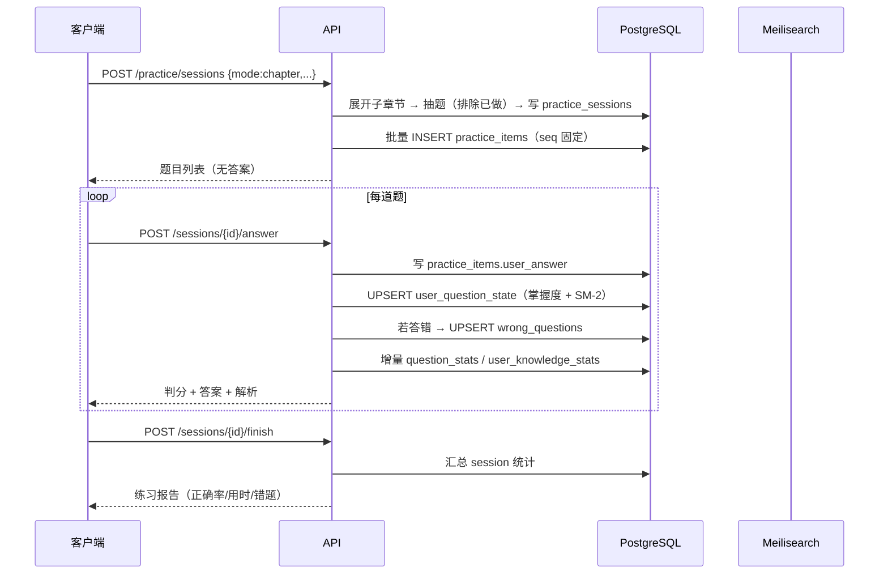
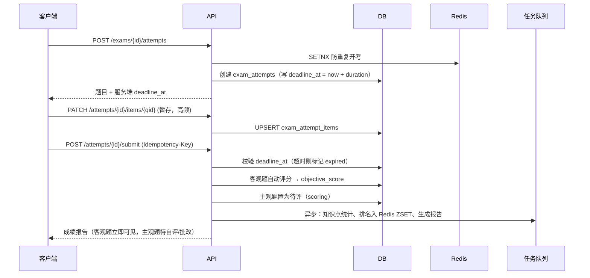
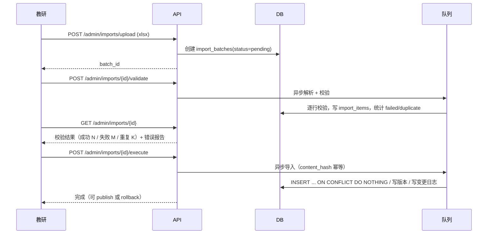

# 04 · API 接口清单

> Base URL：`/api/v1`（学员端）、`/api/v1/admin`（管理端）
> 交互风格：REST + JSON；批量/实时场景预留 WebSocket（考试计时同步、直播）
> 文档：FastAPI 自动生成 Swagger（`/docs`）与 ReDoc（`/redoc`）

---

## 1. 通用规范

### 1.1 统一响应体

```jsonc
// 成功
{
  "code": 0,
  "message": "ok",
  "data": { },
  "trace_id": "01HQ2X...",
  "server_time": 1789000000000
}

// 分页
{
  "code": 0,
  "message": "ok",
  "data": {
    "items": [],
    "page": 1,
    "page_size": 20,
    "total": 1352,
    "has_more": true
  }
}

// 失败
{
  "code": 40101,
  "message": "登录已过期，请重新登录",
  "data": null,
  "trace_id": "01HQ2X...",
  "server_time": 1789000000000
}
```

> `server_time` 每个响应都带，**考试倒计时以它为准**，避免用户改本地时间作弊。

### 1.2 错误码分段

| 段位 | 含义 | 示例 |
|---|---|---|
| `0` | 成功 | |
| `40001–40099` | 参数错误 | `40001` 参数校验失败 |
| `40101–40199` | 认证失败 | `40101` token 过期；`40102` token 无效 |
| `40301–40399` | 权限不足 | `40301` 无接口权限；`40302` 无该科目权益 |
| `40401–40499` | 资源不存在 | `40401` 题目不存在 |
| `40901–40999` | 业务冲突 | `40901` 手机号已注册；`40902` 重复交卷 |
| `42901–42999` | 限流 | `42901` 请求过于频繁；`42902` 验证码发送超限 |
| `50001–50099` | 服务端错误 | `50001` 内部错误 |

### 1.3 鉴权

```
Authorization: Bearer <access_token>
```

| 令牌 | 有效期 | 存放 | 说明 |
|---|---|---|---|
| `access_token` | 2 小时 | 前端内存 / sessionStorage | JWT，payload 含 `uid, roles, scopes, jti` |
| `refresh_token` | 30 天 | httpOnly Cookie 或安全存储 | 存 `user_sessions`，可撤销 |

- 刷新：`POST /auth/refresh`，走 Refresh Token Rotation（旧 token 立即失效）
- 管理端接口额外要求 header `X-Admin-Token`（二次校验，防止 C 端 token 越权访问后台）

### 1.4 限流与防刷

| 维度 | 策略 | 实现 |
|---|---|---|
| IP 全局 | 600 次/分钟 | Nginx `limit_req` |
| 用户维度 | 120 次/分钟（答题 300 次/分钟） | Redis 令牌桶 |
| 短信 | 单手机号 10 条/天、60 秒/条；单 IP 20 条/天 | Redis + `sms_logs` 审计 |
| 登录 | 单账号 5 次失败锁 15 分钟；单 IP 20 次/10 分钟 | Redis 计数 + `risk_events` 告警 |
| 答题提交 | 同一题 3 秒内不可重复提交；单次练习最多 500 题 | Redis SETNX |
| 交卷 | 幂等键 `Idempotency-Key` | Redis SETNX 24h |
| 反爬 | 题目接口不返回完整题库、答案在提交后才下发、图片加水印 | 业务设计 |

**答案下发规则（关键）**：`GET /questions/{id}` 在**用户未作答前不返回 `answer` 与 `analysis`**，只返回题干与选项。作答提交后才通过 `POST /practice/sessions/{id}/answer` 的响应返回答案与解析。这样即使用户抓包也拿不到答案。

### 1.5 幂等

写接口支持可选 header：

```
Idempotency-Key: <uuid>
```

服务端 Redis 缓存 `key → response` 24 小时。用于：下单、支付回调、交卷、批量导入。

### 1.6 版本与兼容

- 路径版本 `/api/v1`
- 新增字段不算破坏性变更；删除/改语义必须升 `/api/v2`
- 前端通过 `GET /api/v1/meta/client-config` 获取灰度开关与最低版本要求

---

## 2. 接口清单

### 2.1 认证 `/auth`

| 方法 | 路径 | 说明 | 鉴权 | 限流 |
|---|---|---|---|---|
| POST | `/auth/sms/send` | 发送短信验证码（scene: register/login/reset/bind） | 否 | 严格 |
| POST | `/auth/register` | 手机号+验证码+密码注册（自动登录） | 否 | 中 |
| POST | `/auth/login/sms` | 验证码登录（未注册则自动注册） | 否 | 中 |
| POST | `/auth/login/password` | 密码登录 | 否 | 严格 |
| POST | `/auth/login/wechat` | 微信授权登录（code 换 session） | 否 | 中 |
| POST | `/auth/refresh` | 刷新 access_token | RT | 中 |
| POST | `/auth/logout` | 登出（撤销当前 refresh_token） | 是 | — |
| POST | `/auth/logout/all` | 登出全部设备 | 是 | — |
| POST | `/auth/password/reset` | 短信验证码重置密码 | 否 | 严格 |
| POST | `/auth/password/change` | 登录态修改密码 | 是 | 中 |
| GET | `/auth/me` | 当前用户 + 角色 + 权益摘要 | 是 | — |
| GET | `/auth/sessions` | 我的登录设备列表 | 是 | — |
| DELETE | `/auth/sessions/{id}` | 踢下线指定设备 | 是 | — |

#### 账号状态与「注销后手机号释放」（2026-09-22 明确语义）

**语义**：`users.is_deleted = true` 即**注销**，同时**释放该手机号** ——
同一手机号再次短信登录会**建一个新账号**（`user_id` 变化），而不是复用旧号、也不是报错。

**为什么这样定**：产品还没到支付 / 试用阶段，"防白嫖"不存在；释放符合用户预期
（用户回来自动就是一个干净的新账号）与合规精神，而且代码更简单 ——
`get_user_by_phone` 只查 `is_deleted = false`，不必给"幽灵手机号"做特判。
落点：`auth_service.get_user_by_phone` 与 `login_by_sms` 的自动建号分支；
用例 `tests/test_sms_inproc.py::test_deleted_account_releases_the_phone`。

⚠️ **「拒绝」和「释放」是两件事，别混**（三条分支的错误码都不一样）：

| 账号状态 | 行为 | 错误码 |
|---|---|---|
| `status = 'disabled'` / `'locked'` | 拒绝登录 | `40305` |
| `status = 'deleted'`（行还在，`is_deleted = false`） | 拒绝登录 | `40104` |
| `is_deleted = true`（真注销） | **释放手机号**：再登录 → 建新号 | —（正常登录） |

> **待办（带触发条件，不是"记得再来改"）**
> **当引入"新用户试用"或"注册送权益"时，重新评估注销策略 —— 是否需要 30 天冷静期？**
> **触发点：第一笔权益 / 试用逻辑上线之前。**
> 理由：在那之前"注销 → 再注册"没有任何可利用的收益；之后就成了可刷的漏洞。

### 2.2 用户与档案 `/users` `/me`

| 方法 | 路径 | 说明 |
|---|---|---|
| GET | `/users/me` | 个人资料 |
| PATCH | `/users/me` | 更新昵称/头像 |
| POST | `/users/me/avatar` | 上传头像（返回 file_id 与 URL） |
| GET | `/users/me/profile` | 学习档案 |
| PUT | `/users/me/profile` | 更新学习档案（科目、专业、省份、目标分） |
| POST | `/users/me/onboarding` | 完成引导（一次性） |
| GET | `/users/me/dashboard` | **首页聚合**：倒计时 + 今日任务 + 续学 + 掌握度 |
| GET | `/users/me/stats` | 学习统计（累计时长/题量/正确率/连续天数） |
| GET | `/users/me/countdown` | 考试倒计时（多节点 + 当前状态机 phase） |
| GET | `/users/me/entitlements` | 我的权益列表 |
| DELETE | `/users/me` | 注销账号（软删除 + 数据脱敏） |
| GET | `/users/me/export` | 导出个人数据（合规） |

### 2.3 会员与支付 `/products` `/orders`

| 方法 | 路径 | 说明 |
|---|---|---|
| GET | `/products` | 商品列表（按 type 筛选） |
| GET | `/products/{id}` | 商品详情 |
| POST | `/coupons/validate` | 校验优惠券可用性 |
| GET | `/orders/preview` | 下单预览（算价、优惠） |
| POST | `/orders` | 创建订单（幂等） |
| GET | `/orders` | 我的订单 |
| GET | `/orders/{id}` | 订单详情 |
| POST | `/orders/{id}/pay` | 发起支付（返回各渠道支付参数） |
| POST | `/orders/{id}/cancel` | 取消订单 |
| POST | `/payments/notify/{channel}` | **支付回调**（验签，白名单 IP，幂等） |
| GET | `/payments/result/{orderNo}` | 前端轮询支付结果 |

### 2.4 科目 / 章节 / 知识点 `/subjects`

| 方法 | 路径 | 说明 |
|---|---|---|
| GET | `/subjects` | 科目列表（可按 category 筛选） |
| GET | `/subjects/{code}` | 科目详情 |
| GET | `/subjects/{id}/chapters` | **章节树**（含进度、题量） |
| GET | `/chapters/{id}` | 章节详情 |
| GET | `/chapters/{id}/knowledge-points` | 知识点列表（含个人掌握度） |
| GET | `/knowledge-points/{id}` | 知识点详情（考点卡片 + 关联题目数） |
| GET | `/knowledge-points/{id}/questions` | 该知识点下的题目（分页） |

### 2.5 课程与学习 `/courses` `/lessons`

| 方法 | 路径 | 说明 |
|---|---|---|
| GET | `/courses` | 课程列表（科目/年份/类型筛选） |
| GET | `/courses/{id}` | 课程详情 + 课时大纲 |
| GET | `/courses/{id}/progress` | 我的课程进度 |
| GET | `/lessons/{id}` | 课时详情（含播放地址签发） |
| GET | `/lessons/{id}/play-auth` | 获取带时效签名的播放 URL（防盗链） |
| POST | `/lessons/{id}/progress` | **上报播放进度**（5 秒一次，UPSERT） |
| GET | `/lessons/{id}/download-auth` | 获取离线下载授权（加密 URL + 密钥） |
| GET | `/lessons/{id}/comments` | 课时评论 |
| POST | `/lessons/{id}/comments` | 发表评论（进审核） |

### 2.6 笔记 / 划线 / 收藏 `/notes` `/highlights` `/favorites`

| 方法 | 路径 | 说明 |
|---|---|---|
| GET | `/notes` | 我的笔记（可按科目/章节/类型筛选，支持全文搜） |
| POST | `/notes` | 新建笔记 |
| PATCH | `/notes/{id}` | 修改笔记 |
| DELETE | `/notes/{id}` | 删除笔记 |
| GET | `/notes/public` | 公开笔记广场 |
| GET | `/highlights?lesson_id=` | 某课时的划线 |
| POST | `/highlights` | 新建划线 |
| DELETE | `/highlights/{id}` | 删除划线 |
| GET | `/favorites` | 我的收藏（type 筛选） |
| POST | `/favorites` | 收藏 |
| DELETE | `/favorites/{id}` | 取消收藏 |

### 2.7 学习计划 `/study-plans`

| 方法 | 路径 | 说明 |
|---|---|---|
| GET | `/study-plans/current` | 当前计划 + 今日任务 |
| POST | `/study-plans/generate` | 自动生成计划（按考试日期倒推） |
| GET | `/study-plans/{id}/calendar` | 计划日历（周/月视图） |
| PATCH | `/study-plan-items/{id}` | 更新任务状态（完成/跳过） |
| POST | `/study-plans/{id}/adjust` | 手动调整（改每日时长/策略） |
| DELETE | `/study-plans/{id}` | 结束计划 |

### 2.8 题库 / 刷题 `/questions` `/practice`

| 方法 | 路径 | 说明 | 备注 |
|---|---|---|---|
| GET | `/questions/filters` | 筛选项元数据（科目/章节/题型/难度/年份/来源） | 前端渲染筛选器 |
| GET | `/questions` | 题库浏览（多条件分页） | 不含答案 |
| GET | `/questions/{id}` | 题目详情 | **未作答不返答案** |
| GET | `/questions/search` | 全文搜索（Meilisearch 代理） | 题干/知识点/标签 |
| POST | `/questions/{id}/report` | 题目报错 | |
| POST | `/practice/sessions` | **创建练习**（mode: chapter/daily/random/wrong/favorite/real/case/kp/custom） | 返回 session + 题目列表（无答案） |
| GET | `/practice/sessions/{id}` | 练习详情（断点恢复，含已答与答案） | |
| POST | `/practice/sessions/{id}/answer` | **提交单题**（返回判分 + 答案 + 解析） | 幂等 |
| POST | `/practice/sessions/{id}/finish` | 结束练习（返回报告） | |
| GET | `/practice/sessions/{id}/result` | 练习报告 | |
| GET | `/practice/sessions/{id}/wrong` | 本次错题列表 | |
| POST | `/practice/daily` | 获取/创建今日每日一练 | 每日唯一 |
| GET | `/practice/history` | 做题记录（按天分组） | |
| GET | `/wrong-questions` | 错题本（筛选：科目/时间/掌握状态） | |
| PATCH | `/wrong-questions/{id}` | 更新（掌握程度/错因标签/移除） | |
| DELETE | `/wrong-questions/{id}` | 移出错题本 | |
| GET | `/wrong-questions/review` | **记忆曲线到期复习队列** | |
| POST | `/wrong-questions/review/submit` | 提交复习结果 | |

#### 创建练习请求示例

```jsonc
POST /api/v1/practice/sessions
{
  "mode": "chapter",
  "subject_id": 1001,
  "chapter_ids": [1101, 1102],       // 含子章节由服务端展开
  "types": ["single", "multiple"],
  "difficulty": [2, 3, 4],
  "count": 20,
  "show_analysis": "immediate",      // immediate | after_finish | never
  "order": "random",                 // random | sequence | by_kp
  "only_unanswered": true,
  "exclude_days": 7                  // 排除最近 7 天做过的
}
```

```jsonc
// 响应
{
  "code": 0,
  "data": {
    "session_id": 8829..., 
    "total": 20,
    "questions": [
      {
        "id": 7712...,
        "seq": 1,
        "type": "single",
        "stem": "…",
        "stem_html": "…",
        "options": [ { "label": "A", "content": "…" } ],
        "difficulty": 3,
        "chapter_id": 1101,
        "knowledge_point_id": 90001,
        "score": 1
        // 注意：无 answer / analysis
      }
    ]
  }
}
```

#### 提交答案请求/响应

```jsonc
POST /api/v1/practice/sessions/8829.../answer
{ "question_id": 7712..., "answer": { "value": ["B"] }, "time_ms": 24300 }
```

```jsonc
{
  "code": 0,
  "data": {
    "is_correct": true,
    "score": 1,
    "correct_answer": { "value": ["B"] },
    "analysis": "…解析…",
    "analysis_points": [],
    "knowledge_point": { "id": 90001, "name": "现金流量图的绘制" },
    "stats": { "correct_rate": 0.62, "attempt_count": 18420 },
    "progress": { "answered": 7, "total": 20, "correct": 5 },
    "mastery": 0.71,
    "next_review_at": "2026-09-18T09:00:00+08:00"
  }
}
```

### 2.9 考试 / 模考 `/exams` `/exam-attempts`

| 方法 | 路径 | 说明 |
|---|---|---|
| GET | `/exams` | 试卷列表（type: real/mock/chapter_test/sprint） |
| GET | `/exams/{id}` | 试卷详情（含卷面结构与须知，不含题目） |
| GET | `/exams/{id}/intro` | 考前须知（规则、分值与时长） |
| POST | `/exams/{id}/attempts` | **开始考试**（创建 attempt，写 deadline_at，返回题目） |
| GET | `/exam-attempts/{id}` | 恢复考试（已答 + 剩余时间） |
| PATCH | `/exam-attempts/{id}/items/{questionId}` | **暂存单题答案**（高频，轻量） |
| POST | `/exam-attempts/{id}/items/{questionId}/mark` | 标记/取消标记 |
| POST | `/exam-attempts/{id}/heartbeat` | 心跳（防多端同时作答） |
| POST | `/exam-attempts/{id}/submit` | **交卷**（幂等，自动评分客观题） |
| GET | `/exam-attempts/{id}/report` | 成绩报告（得分/知识点雷达/用时分布/错题） |
| GET | `/exam-attempts/{id}/review` | 逐题回顾（含答案与解析） |
| POST | `/exam-attempts/{id}/self-score` | 主观题自评提交（逐评分点） |
| GET | `/exam-attempts` | 我的考试记录 |
| GET | `/exams/{id}/ranking` | 排行榜（本科目 Top N + 我的位置） |
| GET | `/exams/{id}/stats` | 试卷统计（平均分、及格率、分数段分布） |

### 2.10 智能学习 `/me/...`

| 方法 | 路径 | 说明 |
|---|---|---|
| GET | `/me/weak-points` | 薄弱知识点分析（Top N + 归因） |
| GET | `/me/recommendations` | 今日推荐（题/课/复习） |
| POST | `/me/recommendations/{id}/consume` | 消费推荐（标记已处理） |
| GET | `/me/report/weekly` | 周报 |
| GET | `/me/report/monthly` | 月报 |
| POST | `/me/report/{id}/share` | 生成分享图 |
| GET | `/me/knowledge-map` | 知识点掌握图谱（雷达/热力） |
| GET | `/me/score-prediction` | 成绩预测（是否达及格线） |
| GET | `/me/streak` | 打卡与积分 |

### 2.11 资讯与消息 `/announcements` `/notifications`

| 方法 | 路径 | 说明 |
|---|---|---|
| GET | `/announcements` | 公告列表（按 type 筛选） |
| GET | `/announcements/{id}` | 公告详情（阅读数 +1） |
| GET | `/exam-calendar` | 考试日历（可按年份/专业） |
| GET | `/notifications` | 消息列表（未读数） |
| POST | `/notifications/read` | 批量已读 |
| POST | `/notifications/read-all` | 全部已读 |
| GET | `/banners?position=home_top` | Banner |
| POST | `/feedbacks` | 意见反馈 |
| GET | `/meta/client-config` | 客户端配置（开关、最低版本、公告） |

### 2.12 上传 `/files`

| 方法 | 路径 | 说明 |
|---|---|---|
| POST | `/files/presign` | 获取预签名上传 URL（直传 MinIO/S3，不过应用服务器） |
| POST | `/files/callback` | 上传完成回调（落 `files` 表） |
| GET | `/files/{id}` | 文件信息与访问 URL |

---

### 2.13 管理端 `/admin`

#### 认证与工作台

| 方法 | 路径 | 说明 | 权限 |
|---|---|---|---|
| POST | `/admin/auth/login` | 后台登录（独立登录，强校验） | — |
| GET | `/admin/dashboard/overview` | 核心指标（DAU/新增/题量/收入） | `stats:read` |
| GET | `/admin/dashboard/trends` | 趋势图数据 | `stats:read` |

#### 题库管理

| 方法 | 路径 | 说明 | 权限 |
|---|---|---|---|
| GET | `/admin/questions` | 题目列表（含草稿，高级筛选） | `question:read` |
| GET | `/admin/questions/{id}` | 题目详情（含答案，含版本） | `question:read` |
| POST | `/admin/questions` | 新增题目 | `question:create` |
| PUT | `/admin/questions/{id}` | 编辑题目（自动存版本） | `question:update` |
| DELETE | `/admin/questions/{id}` | 软删除 | `question:delete` |
| POST | `/admin/questions/batch-delete` | 批量删除 | `question:delete` |
| POST | `/admin/questions/batch-update` | 批量改章节/难度/标签 | `question:update` |
| POST | `/admin/questions/{id}/submit-review` | 提交审核 | `question:update` |
| POST | `/admin/questions/{id}/approve` | 审核通过 | `question:review` |
| POST | `/admin/questions/{id}/reject` | 审核驳回（填原因） | `question:review` |
| POST | `/admin/questions/{id}/publish` | 发布 | `question:publish` |
| POST | `/admin/questions/{id}/archive` | 归档 | `question:publish` |
| GET | `/admin/questions/{id}/versions` | 版本历史 | `question:read` |
| POST | `/admin/questions/{id}/rollback` | **回滚到指定版本** | `question:rollback` |
| GET | `/admin/questions/{id}/stats` | 该题作答统计 | `question:read` |
| GET | `/admin/questions/duplicates` | 疑似重复题检测 | `question:read` |

#### 导入导出

| 方法 | 路径 | 说明 | 权限 |
|---|---|---|---|
| GET | `/admin/imports/template` | 下载导入模板（xlsx/csv/json） | `question:import` |
| POST | `/admin/imports/upload` | 上传文件创建批次 | `question:import` |
| POST | `/admin/imports/{id}/validate` | 校验（dry-run，返回错误报告） | `question:import` |
| POST | `/admin/imports/{id}/execute` | 执行导入 | `question:import` |
| GET | `/admin/imports` | 批次列表 | `question:read` |
| GET | `/admin/imports/{id}` | 批次详情 + 逐行结果 | `question:read` |
| GET | `/admin/imports/{id}/errors` | 下载错误报告 | `question:read` |
| POST | `/admin/imports/{id}/rollback` | **回滚整个批次** | `question:rollback` |
| POST | `/admin/questions/export` | 导出题目（按筛选条件） | `question:read` |
| GET | `/admin/bank-versions` | 题库版本列表 | `question:read` |
| POST | `/admin/bank-versions` | 创建基线快照 | `question:publish` |

#### 审核与质量

| 方法 | 路径 | 说明 | 权限 |
|---|---|---|---|
| GET | `/admin/review/queue` | 待审队列 | `question:review` |
| POST | `/admin/review/batch-approve` | 批量通过 | `question:review` |
| GET | `/admin/question-reports` | 用户报错列表 | `question:read` |
| POST | `/admin/question-reports/{id}/handle` | 处理报错 | `question:update` |
| GET | `/admin/quality/anomalies` | 异常题预警（正确率过低/过高/区分度为负） | `stats:read` |

#### 章节 / 知识点

| 方法 | 路径 | 说明 |
|---|---|---|
| GET/POST/PUT/DELETE | `/admin/chapters[/{id}]` | 章节 CRUD |
| POST | `/admin/chapters/import` | 章节批量导入 |
| GET/POST/PUT/DELETE | `/admin/knowledge-points[/{id}]` | 知识点 CRUD |
| POST | `/admin/chapters/recount` | 重算题目计数 |

#### 试卷与考试

| 方法 | 路径 | 说明 |
|---|---|---|
| GET | `/admin/exams` | 试卷列表 |
| POST | `/admin/exams` | 创建试卷 |
| PUT | `/admin/exams/{id}` | 编辑 |
| POST | `/admin/exams/{id}/sections` | 设置卷面结构 |
| POST | `/admin/exams/{id}/questions` | 加题（支持批量） |
| DELETE | `/admin/exams/{id}/questions/{qid}` | 移除题目 |
| POST | `/admin/exams/{id}/auto-compose` | **规则自动组卷** |
| POST | `/admin/exams/{id}/validate` | 校验卷面（分值/题量/难度分布） |
| POST | `/admin/exams/{id}/publish` | 发布 |
| GET | `/admin/exams/{id}/analysis` | 试卷分析（分数分布、区分度） |
| GET | `/admin/attempts` | 全站考试记录 |
| POST | `/admin/attempts/{id}/grade` | **人工批改主观题** |
| GET | `/admin/grading/queue` | 待批改队列 |
| POST | `/admin/paper-rules` | 组卷规则 CRUD |

#### 课程与内容

| 方法 | 路径 | 说明 |
|---|---|---|
| GET/POST/PUT/DELETE | `/admin/courses[/{id}]` | 课程 CRUD |
| GET/POST/PUT/DELETE | `/admin/lessons[/{id}]` | 课时 CRUD |
| POST | `/admin/lessons/{id}/transcode` | 触发转码（HLS） |
| GET/POST/PUT/DELETE | `/admin/announcements[/{id}]` | 公告 CRUD |
| GET/POST/PUT/DELETE | `/admin/banners[/{id}]` | Banner CRUD |
| POST | `/admin/push-tasks` | 创建推送任务 |
| POST | `/admin/push-tasks/{id}/send` | 立即/定时发送 |
| GET | `/admin/push-tasks/{id}/report` | 送达报告 |
| GET/PUT | `/admin/feedbacks` | 反馈处理 |
| GET/POST/PUT/DELETE | `/admin/exam-calendar[/{id}]` | 考试日历维护 |

#### 用户与订单

| 方法 | 路径 | 说明 | 权限 |
|---|---|---|---|
| GET | `/admin/users` | 用户列表（多条件筛选、导出） | `user:read` |
| GET | `/admin/users/{id}` | 用户详情（含学习档案、答题统计、订单） | `user:read` |
| PATCH | `/admin/users/{id}` | 修改用户（状态、标签、备注） | `user:manage` |
| POST | `/admin/users/{id}/reset-password` | 重置密码 | `user:manage` |
| POST | `/admin/users/{id}/grant-entitlement` | **手动发放权益** | `user:manage` |
| POST | `/admin/users/{id}/revoke-entitlement` | 撤销权益 | `user:manage` |
| POST | `/admin/users/batch-tag` | 批量打标 | `user:manage` |
| GET | `/admin/users/export` | 导出（脱敏，走审批） | `user:export` |
| GET | `/admin/orders` | 订单列表 | `order:read` |
| GET | `/admin/orders/{id}` | 订单详情 | `order:read` |
| POST | `/admin/orders/{id}/refund` | 退款（二次确认 + 审计） | `order:refund` |
| GET | `/admin/entitlements` | 权益列表 | `order:read` |
| GET | `/admin/products` | 商品 CRUD | `content:manage` |
| POST | `/admin/coupons` | 优惠券 CRUD | `content:manage` |

#### 统计

| 方法 | 路径 | 说明 |
|---|---|---|
| GET | `/admin/stats/overview` | 总览（用户/题量/答题量/收入） |
| GET | `/admin/stats/users` | 用户增长与留存 |
| GET | `/admin/stats/learning` | 学习数据（时长、题量、正确率趋势） |
| GET | `/admin/stats/questions` | 题目数据（各科题量、难度分布、正确率） |
| GET | `/admin/stats/exams` | 考试数据（参与人数、平均分、及格率） |
| GET | `/admin/stats/revenue` | 收入（订单数、金额、转化率、ARPU） |
| GET | `/admin/stats/funnel` | 转化漏斗 |
| GET | `/admin/stats/export` | 导出报表 |

#### 系统

| 方法 | 路径 | 说明 |
|---|---|---|
| GET/POST/PUT/DELETE | `/admin/system/roles[/{id}]` | 角色 CRUD |
| GET | `/admin/system/permissions` | 权限树 |
| PUT | `/admin/system/roles/{id}/permissions` | 分配权限 |
| POST | `/admin/system/users/{id}/roles` | 分配用户角色（带数据范围） |
| GET/PUT | `/admin/system/configs[/{key}]` | 系统参数 |
| GET/POST/PUT/DELETE | `/admin/system/dictionaries[/{id}]` | 数据字典 |
| GET | `/admin/system/audit-logs` | 审计日志 |
| GET | `/admin/system/risk-events` | 风控告警 |
| GET | `/admin/system/health` | 健康检查（DB/Redis/Meili/MinIO） |
| POST | `/admin/system/cache/clear` | 清理指定缓存 |
| GET | `/admin/system/tasks` | 定时任务列表与执行记录 |
| POST | `/admin/system/tasks/{id}/run` | 手动触发任务 |

---

## 3. 关键接口时序

### 3.1 章节练习完整链路



### 3.2 模考交卷与评分



### 3.3 批量导入



---

## 4. 性能与缓存约定

| 接口 | 缓存 | TTL | 失效触发 |
|---|---|---|---|
| `GET /subjects` | Redis | 1 天 | 科目变更 |
| `GET /subjects/{id}/chapters` | Redis（不含个人进度） | 1 小时 | 章节变更 |
| `GET /announcements` | Redis | 5 分钟 | 公告发布 |
| `GET /banners` | Redis | 5 分钟 | Banner 变更 |
| `GET /exam-calendar` | Redis | 1 小时 | 日历变更 |
| `GET /questions/{id}` | Redis（题目本体） | 1 小时 | 题目更新时主动删 |
| `GET /me/dashboard` | Redis | 60 秒 | 答题后主动删 |
| `GET /exams/{id}/ranking` | Redis ZSET 实时 | — | — |
| 个人进度类 | **不缓存** | — | — |

### 接口性能目标

| 接口 | P95 目标 |
|---|---|
| 登录/注册 | < 300ms |
| 章节树 | < 80ms（命中缓存 < 10ms） |
| 创建练习（抽 20 题） | < 200ms |
| 提交单题 | < 150ms |
| 交卷（78 题） | < 800ms |
| 题库搜索 | < 120ms |
| 首页聚合 | < 200ms |
